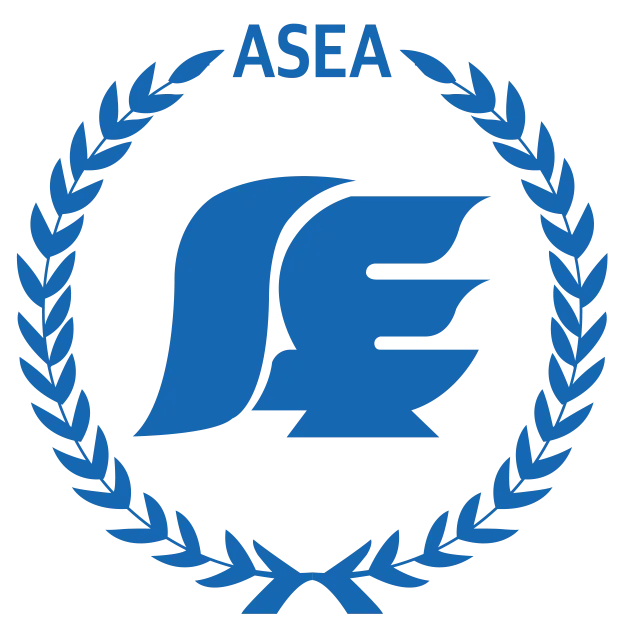

# ASEA 항공직업전문학교 영문 웹사이트

> "Your First Step to the Sky, Turn Your Aviation Dreams into Reality!"

<div align="center">
  

[](https://asea-eng.netlify.app/)
[](https://reactjs.org/)
[](https://www.typescriptlang.org/)
[](https://tailwindcss.com/)
[](https://vitejs.dev/)

**🌐 [공식 웹페이지](https://eng.asea.or.kr/) | 📚 [개인 서버 배포](https://asea-eng.netlify.app/)**
</div>

## 📋 프로젝트 개요

ASEA 항공직업전문학교의 공식 영문 웹사이트입니다. 기존 PHP 기반 한국어 사이트를 React + TypeScript로 현대화하고 완전 영문화한 개인 포트폴리오 프로젝트입니다. 33년 역사의 국토교통부 지정 항공정비사 양성기관을 글로벌 학생들에게 소개하는 것이 목표입니다.

### 🎯 주요 특징

- **📱 완전 반응형 디자인** - 모든 디바이스에서 완벽한 사용자 경험
- **🌐 완전 영문화** - 한국어 원본을 전문적으로 번역 및 현지화
- **⚡ 고성능 웹앱** - React + TypeScript + Vite 최신 기술 스택
- **🎨 모던 UI/UX** - 깔끔하고 전문적인 디자인과 부드러운 애니메이션
- **♿ 웹 접근성 준수** - WCAG 2.1 AA 표준 준수
- **🚀 빠른 로딩** - 성능 최적화 및 SEO 친화적

## 🏛️ ASEA 항공직업전문학교 소개

- **설립**: 1993년 (33년 전통)
- **지정**: 국토교통부 지정 항공정비사 전문교육기관
- **모집정원**: 420명 (전국 최대규모)
- **특성화**: 5개 계열 19개 이상 전문과정
- **취업률**: 91% (국방·경찰공무원, 최근 9년간)
- **캠퍼스**: 서울캠퍼스(영등포) + 이천캠퍼스(실습장)

## 🛠️ 기술 스택

### 핵심 기술
- **프론트엔드**: React 18 + TypeScript
- **빌드 도구**: Vite 5.0
- **스타일링**: Tailwind CSS 3.0
- **라우팅**: React Router DOM v6
- **배포**: GitHub Pages (자동 CI/CD)

### 개발 도구
- **패키지 매니저**: npm
- **버전 관리**: Git + GitHub
- **코드 품질**: ESLint + Prettier
- **타입 안전성**: TypeScript strict mode

## 📁 프로젝트 구조

```
src/
├── components/
│   ├── layout/
│   │   ├── Header.tsx          # 메가메뉴 네비게이션
│   │   └── Footer.tsx          # 연락처 및 링크
│   ├── sections/
│   │   ├── HeroSection.tsx     # 메인 히어로 섹션
│   │   ├── EmploymentShowcaseSection.tsx  # 취업자 현황 캐러셀
│   │   ├── PartnershipShowcaseSection.tsx # 파트너십 조직
│   │   └── ContactSection.tsx  # 연락처 및 위치 정보
│   └── ui/                     # 재사용 가능한 UI 컴포넌트
├── pages/
│   ├── about/                  # ASEA 소개 (7개 페이지)
│   ├── departments/            # 5개 항공 계열
│   ├── campus-life/            # 캠퍼스 시설 및 생활
│   ├── admission/              # 입학 정보
│   ├── employment/             # 취업 현황 및 통계
│   └── HomePage.tsx            # 메인 랜딩 페이지
├── data/
│   ├── about/                  # 학교 정보 데이터
│   ├── departments/            # 계열 및 프로그램 데이터
│   ├── employment/             # 졸업생 취업 데이터
│   └── facilities/             # 캠퍼스 시설 데이터
└── router/                     # 애플리케이션 라우팅 설정
```

## 🎓 교육 계열 소개

### 1. 항공정비계열 🔧
- **프로그램**: 항공정비사, 항공기계, 항공부사관, 드론, 항공정비공학사[3년제]
- **특징**: 국토교통부 지정 최다 모집정원 420명

### 2. 스마트안전진단계열 🔍
- **프로그램**: 초음파진단, 항공비파괴검사, 금속공학사[3년제]
- **특징**: 2023년 캠퍼스리쿠르팅 100% 전원 채용합격

### 3. 항공관광계열 ✈️
- **프로그램**: 승무원, 호텔관광전문가, 식음료전문가
- **특징**: 3+2제도 운영, 수도권 유일 크루즈전문인력 양성기관

### 4. 항공보안계열 🛡️
- **프로그램**: 항공보안, 의전경비, PMC경비, 액션연기, 스포츠재활컨디셔닝
- **특징**: 신변보호사 합격자 8년 연속 전국 1위

### 5. 국방경찰AI계열 🎖️
- **프로그램**: 국방사관, 국방부사관, 국방AI, 경찰공무원
- **특징**: 육군3사관학교 10년 연속 전국 1위, 최근 9년간 91% 장교/부사관 진출

## 🌟 주요 기능 및 특징

### 🎨 모던 디자인 시스템
- **일관된 색상 팔레트**: 계열별 테마 색상 (blue-900, emerald-700, rose-700, slate-800, amber-700)
- **반응형 타이포그래피**: 명확한 계층 구조의 텍스트 스케일링
- **컴포넌트 라이브러리**: TypeScript 지원 재사용 가능한 UI 컴포넌트
- **웹 접근성**: WCAG 2.1 AA 준수, 적절한 ARIA 라벨

### ⚡ 성능 최적화
- **코드 스플리팅**: 최적 번들 크기를 위한 지연 로딩
- **이미지 최적화**: WebP 포맷 및 폴백 지원
- **캐싱 전략**: 오프라인 지원을 위한 서비스 워커
- **SEO 최적화**: 메타 태그, 구조화된 데이터, 사이트맵

### 📱 반응형 디자인
- **모바일 우선**: 스마트폰과 태블릿에 최적화
- **브레이크포인트**: sm(640px), md(768px), lg(1024px), xl(1280px)
- **터치 친화적**: 적절한 터치 타겟과 제스처
- **크로스 브라우저**: 모든 최신 브라우저와 호환

### 🎯 특별한 기능들
- **무한 스크롤 섹션**: 취업자 현황과 파트너십 조직을 부드럽게 표시
- **메가 메뉴**: 모든 페이지에 쉽게 접근할 수 있는 네비게이션
- **인터랙티브 갤러리**: 시설 안내 필터링 및 이미지 갤러리
- **다국어 지원 준비**: 향후 다국어 확장을 위한 구조

## 🚀 시작하기

### 사전 요구사항
- Node.js 18+
- npm 9+
- Git

### 설치 및 실행

1. **저장소 클론**
   ```bash
   git clone https://github.com/prnsslcn/asea-eng.git
   cd asea-eng
   ```

2. **의존성 설치**
   ```bash
   npm install
   ```

3. **개발 서버 실행**
   ```bash
   npm run dev
   ```

4. **브라우저에서 확인**
   ```
   http://localhost:5173
   ```

### 빌드 및 배포

```bash
# 프로덕션 빌드
npm run build

# 프로덕션 빌드 미리보기
npm run preview

# GitHub Pages 배포
npm run deploy
```

## 🎯 개발 하이라이트

### 🔥 핵심 성과
- **완전 반응형**: 모바일부터 데스크톱까지 완벽한 UI/UX
- **TypeScript 100%**: 전체 코드베이스 타입 안전성 확보
- **무한 스크롤**: Netflix 스타일의 부드러운 무한 스크롤 구현
- **데이터 중심**: 구조화된 데이터와 효율적인 상태 관리
- **SEO 최적화**: 검색 엔진 친화적인 구조

### 💡 기술적 도전과 해결
- **무한 스크롤 구현**: 카드 복제와 애니메이션 없는 리셋으로 자연스러운 무한 반복
- **다국어 구조**: 향후 확장을 위한 국제화 준비
- **성능 최적화**: 이미지 지연 로딩과 코드 스플리팅
- **접근성**: 키보드 네비게이션과 스크린 리더 지원

## 🔄 개발 워크플로

### Git Flow
- **main**: 프로덕션 배포용 (GitHub Pages 자동 배포)
- **develop**: 기능 통합 브랜치
- **feature/***: 개별 기능 개발 브랜치

### 코드 표준
- **TypeScript**: Strict 모드로 완전한 타입 커버리지
- **ESLint**: React 규칙이 포함된 Airbnb 설정
- **Prettier**: 일관된 코드 포맷팅
- **Conventional Commits**: 구조화된 커밋 메시지

## 🏆 프로젝트 의의

이 프로젝트는 단순한 웹사이트 리뉴얼을 넘어서, 한국의 전문교육기관을 글로벌 시장에 소개하는 디지털 트랜스포메이션 사례입니다. 33년 전통의 교육기관이 현대적인 웹 기술을 통해 어떻게 젊은 세대와 소통할 수 있는지 보여주는 포트폴리오 작품입니다.

### 기술 문의
- **개발자**: [GitHub Profile](https://github.com/prnsslcn)
- **이슈 제보**: [GitHub Issues](https://github.com/prnsslcn/asea-eng/issues)

---

<div align="center">
  <p>© 2025 ASEA Aviation College. All rights reserved.</p>
</div>